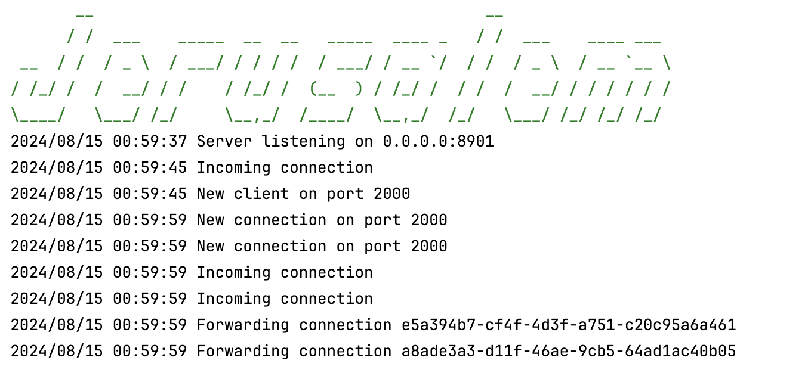

# Jerusalem Tunnel

Jerusalem Tunnel is a cross-platform `ngrok` alternative written in Go. It allows clients to reserve a port and complete
a handshake using a secret key shared between the server and the client, identified uniquely by a clientID.


## Features

- **Cross-Platform**: Works on Windows, macOS, and Linux.
- **Port Reservation**: Reserve a port for the client.
- **Secure Handshake**: Client and server complete a handshake using a secret key and unique clientID.

## Installation

1. Ensure you have [Go 1.22](https://golang.org/dl/) or later installed.
2. Clone the repository:

    ```bash
    git clone https://github.com/yourusername/jerusalem-tunnel.git
    cd jerusalem-tunnel
    ```

3. Build the project:

    ```bash
    go build -o jerusalem-tunnel -v ./...
    ```

## Usage

Start the server:

    ./jerusalem-tunnel --config config.yaml

Start the server using Docker:

    ```bash
    docker build -t jerusalem-tunnel .
    docker run -d -p 8901:8901 --name jerusalem-tunnel -v $(pwd)/config.yaml:/app/config.yaml jerusalem-tunnel
    ```

## Configuration

The server requires a configuration file in YAML format to run. Example `server.yaml`:

```yaml
PORT_RANGE: "2000...8999"
SECRET_KEY: "2y6sUp8cBSfNDk7Jq5uLm0xHAIOb9ZGqE4hR1WVXtCwKjP3dYzvTn2QiFXe8rMb6"
SERVER_PORT: 8901
```

## Contributing

Contributions are welcome! Please fork the repository and submit a pull request.

## License

This project is licensed under the MIT License. See the [LICENSE](LICENSE) file for details.